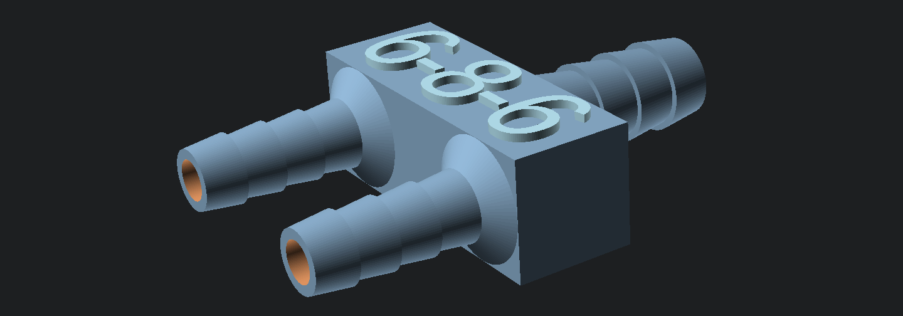

# flower-box-hose-system

A set of 3D printable sprinklers and hose connectors to build an automatic watering system for flower boxes, e.g. on your balcony.

This project is licensed under the terms of the GNU General Public License v3.0.

Author: Marius Montebaur

## Print Settings

Detailed descriptions on how to adjust the print settings can be found [here](https://montebaur.tech/projects/waterproof_3d-printing.html).

Summary: To make the components waterproof adjustments to the print setting are necessary (parameter names from Cura)
- Infill density: `100%`
- Wall thickness: 4 lines
- Flow (or extrusion multiplier): `108%`. Tells the printer to use more filament than necessary to close gaps between neighboring filament lines.
- Printing Temperature: `215°C`. A bit hotter than usual to make the filament flow better.

## Changelog

### 2021-05-09:
- Added parameters for hoses with 6mm inner diameter ([`Parameters.scad`](Parameters.scad))
- Updated box shaped splitter ([`HoseSplitter_BoxShape.scad`](HoseSplitter_BoxShape.scad)) to accept different inlet and outlet diameters and added numbers on the housing.

